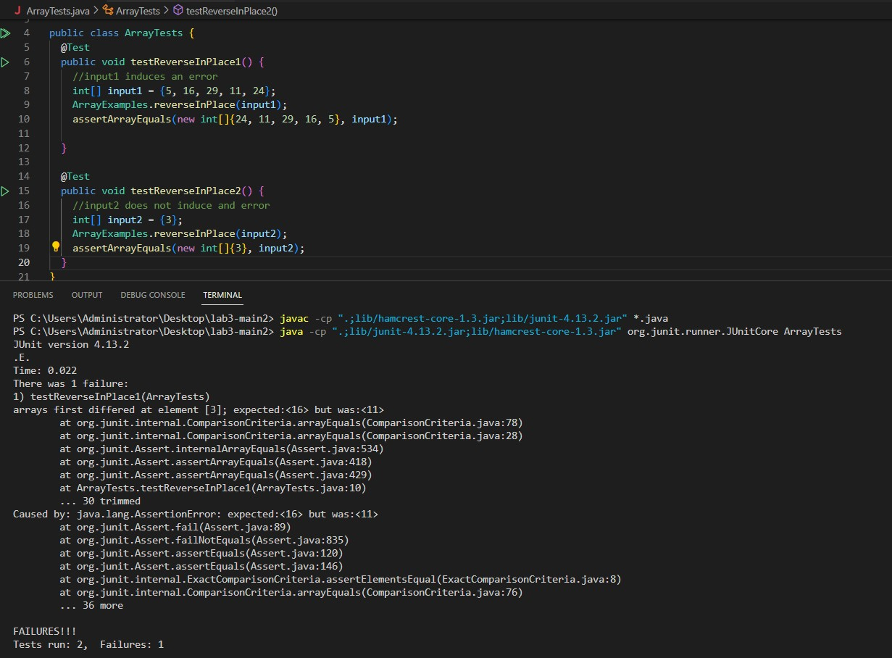

# Lab report 2
## Part 1
  

Called methods:
* **Integer.parseInt(args[0])** is called to get a port number as an integer from the passed arguments. For both screenshots it gets *args[0]* = "2012" (a String type) as an argument and converts it to integer. The value is stored in the *port* variable.
* **Server.start(port, new Handler())** starts a server. The arguments are *port* = 2012 and a new *Handler()* object.
* **handleRequest(URI url)** is a method within the Handler class. It takes the *url* variable (_URI_ type) as an argument and performs these operations:
  1. **url.getPath()** takes _url_ as an argument and returns a pathname as a String. For both screenshots the pathname is "/add-message".
  2. **url.getPath().equals("/")** compares the pathname with "/". For both methods it returns false since the pathname is "/add-message".
  3. **System.out.println("Path: " + url.getPath())** prints out the pathname in format _Path: /add-message_.
  4. **url.getPath().contains("/add-message")** checks if the pathname contains the "/add-message" command. For both screenshots the method will return true.
  5. **url.getGuery()** returns query as a String. For screenshot 1 it is "s=Hi!", for 2 - "s=My name is Anya Chernova".
  6. **url.getQuery().split("=")** splits query around "=" . For screenshot 1 we get ["s", "Hi!"], for 2 - ["s", "My name is Anya Chernova"]. The arrays are stored in the _parameters_ veriable.
  7. **parameters[0].equals("s")** checks if the first element of _parameters_ is "s". The method returns true for both screenshots.
  8. The String variable _str_ which is initially empty becomes _str + parameters[1]_. For screenshot 1 _str_ is updated from "" to "Hi!". For 2 (since _str_ stores the changes made after the 1 case) it is updated from "Hi!" to "Hi!\nMy name is Anya Chernova".
  9. **String.format(str)** returns a formatted string _str_. It is what the **handleRequest(URI url)** method returns for both cases and is what we see on the screenshots.  


## Part 2
Code before:
```
public class ArrayExamples {
    static void reverseInPlace(int[] arr) {
        for(int i = 0; i < arr.length; i += 1) {
            arr[i] = arr[arr.length - i - 1];
        }
    }
}  
```  

JUnit test with input that induces an error:
```
import static org.junit.Assert.*;
import org.junit.*;

public class ArrayTests {
    @Test 
    public void testReverseInPlace1() {
        int[] input1 = {5, 16, 29, 11, 24};
        ArrayExamples.reverseInPlace(input1);
        assertArrayEquals(new int[]{24, 11, 29, 16, 5}, input1);
    }
}
```   
JUnit test with input that does not induce an error:
```
import static org.junit.Assert.*;
import org.junit.*; 

public class ArrayTests {
    @Test 
    public void testReverseInPlace2() {
        int[] input2 = {3};
	ArrayExamples.reverseInPlace(input2);
	assertArrayEquals(new int[]{3}, input2);
    }
}
```  
Tests output:
  

Code after:  
```
public class ArrayExamples {
    static void reverseInPlace(int[] arr) {
        for(int i = 0; i < arr.length/2; i += 1) {
            int temp = arr[i];
            arr[i] = arr[arr.length - i - 1];
            arr[arr.length - i - 1] = temp;
        }
    }
}
```  
The code before was just assigning the value of the element at index  _arr.length - i - 1_ to the element at index _i_ instead of swapping them. To actually swap them we need to create an extra variable which will store the initial value of the element at index _i_. After we assign the value of the _arr.length - i - 1_ element to _i_ element, we can assign the initial value of the _i_ element (which is stored in the _temp_ variable) to the _arr.length - i - 1_ element. In addition, in the loop the condition _arr.length < 0_ induces an error since when we reach the middle of the array the values are gonna be swapped back to the original, so the condition is supposed to be _arr.length/2 < 0_.  
## Part 3
I learned: 
* about web servers, specifically about the URLHandler interface and how to build and run a server on my computer;
* how to use GitHub Destop to commit and push changes I make while working in VSCode;
* what the commands used to run JUnit tests mean.  

Thank you for reading!
