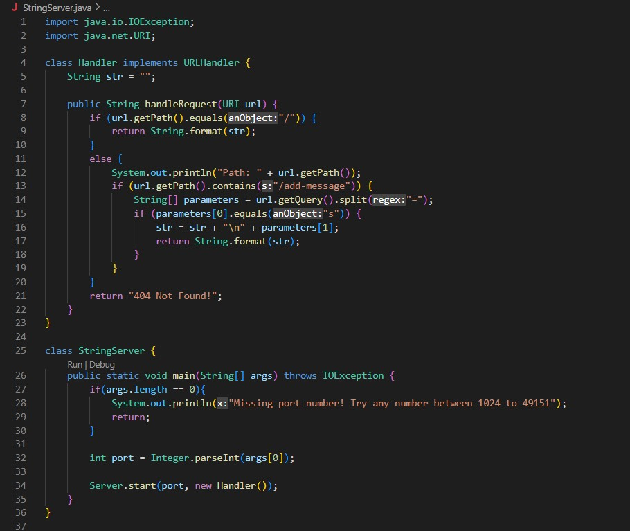
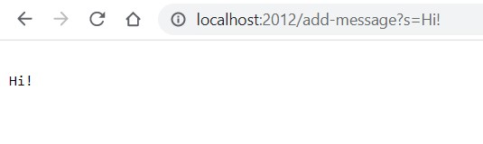
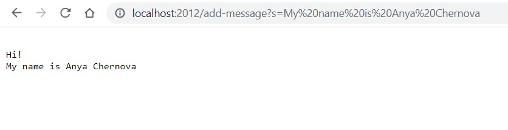

## Part 1
  

* Integer.parseInt(args[0]) is called to get a port number as an integer from the passed arguments. For both screenshots it gets "2012" (a String type) and converts it to integer. The value is stored in port variable.
* Server.start(port, new Handler()) starts a server for both screenshots. The parameters are port and a new Handler() object.
* handleRequest(URI url) is a method within the Handler class. It takes URL as a parameter (url) and performs these operations:
  1. url.getPath() returns pathname as a String
  2. url.getPath().equals("/") compares the pathname with "/". For both methods it returns false since we use the "/add-message" command.
  3. System.out.println("Path: " + url.getPath()) prints out the path name
  4. url.getPath().contains("/add-message") checks if the pathname contains the "/add-message" command. For both screenshots the method will return true.
  5. url.getGuery() returns query as a String. For screenshot 1 it is s=Hi!, for 2 - s=My name is Anya Chernova.
  6. url.getQuery().split("=") splits query around "=". For screenshot 1 we get ["s", "Hi!"], for 2 - ["s", "My name is Anya Chernova"].
  7. 

