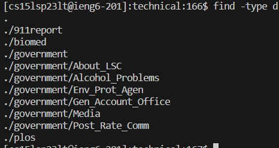
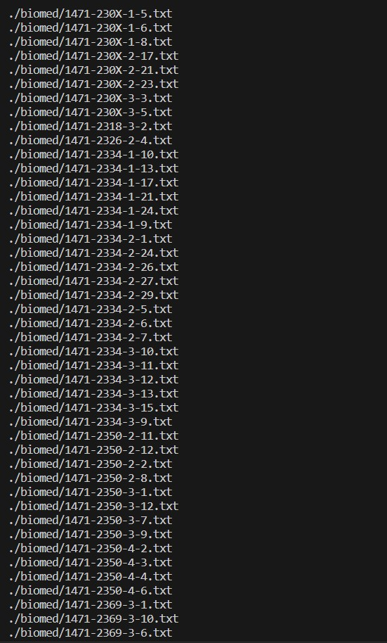
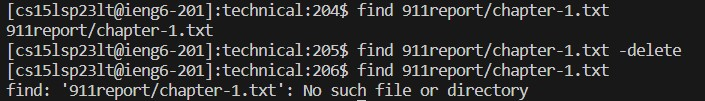
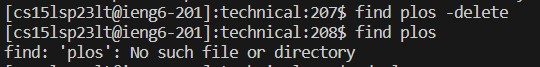
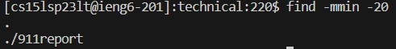
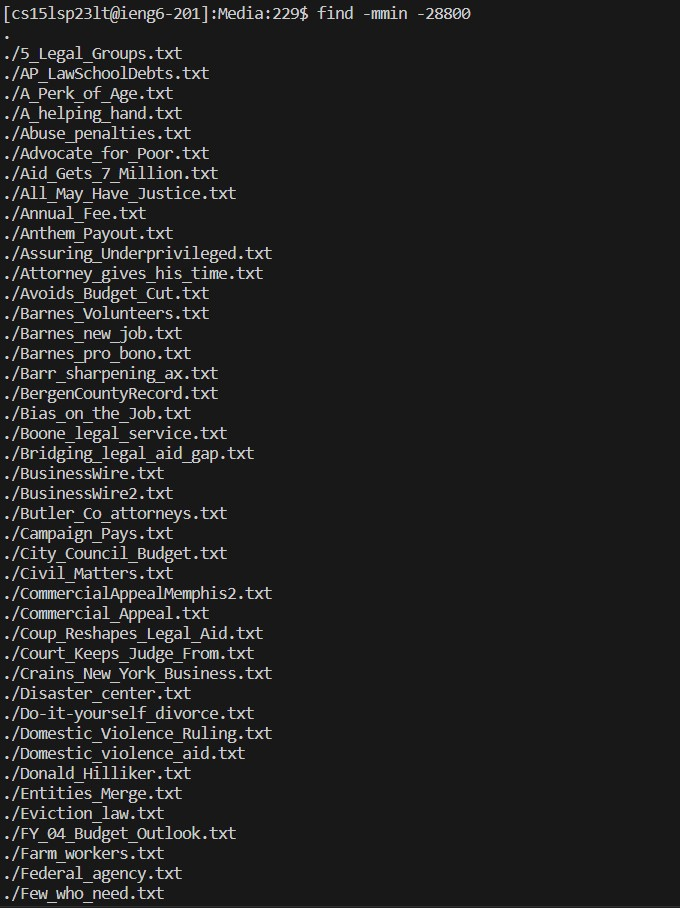

# Lab report
## find  
Source: https://man7.org/linux/man-pages/man1/find.1.html  

### size
-size allows us to search files based on their size. This can be useful for various tasks e.g. finding the smallest/biggest file. It takes units of space (n) as a parameter. To find files that are bigger than n we can add "+" in front of the parameter, for files that are smaller - "-", and nothing for files that take exactly n units of space. By default units of space are 512-byte blocks, but we can use other units by adding a suffixes.  
1. In this example I used a suffix "k" for kibibytes (KiB, units of 1024 bytes), so this command outputs files in technical/ that are bigger than 200 KiB.  
```
[cs15lsp23lt@ieng6-201]:technical:235$ find -size +200k
./911report/chapter-13.4.txt
./911report/chapter-13.5.txt
./911report/chapter-3.txt
./government/About_LSC/commission_report.txt
./government/Env_Prot_Agen/bill.txt
./government/Gen_Account_Office/GovernmentAuditingStandards_yb2002ed.txt
./government/Gen_Account_Office/Statements_Feb28-1997_volume.txt
./government/Gen_Account_Office/d01591sp.txt
```
2. In this example I used a suffix "c" for for bytes, so this command outputs files in technical/ that are smaller than 1000 bytes.
```
[cs15lsp23lt@ieng6-201]:technical:242$ find -size -1000c
./plos/pmed.0020191.txt
./plos/pmed.0020226.txt
```  

### type  
  
 
### delete  
  
  
### mmin
  
  

