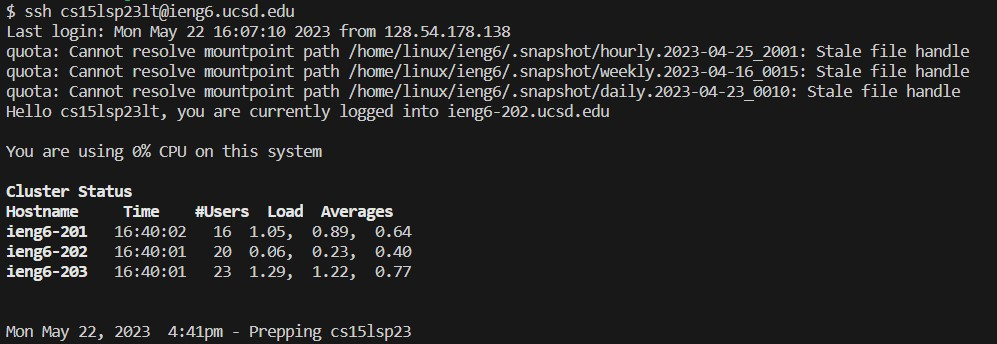
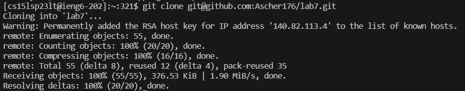
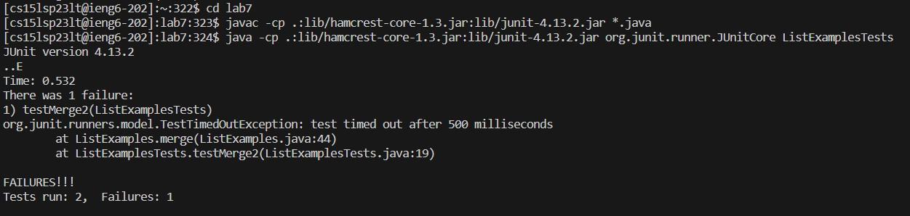
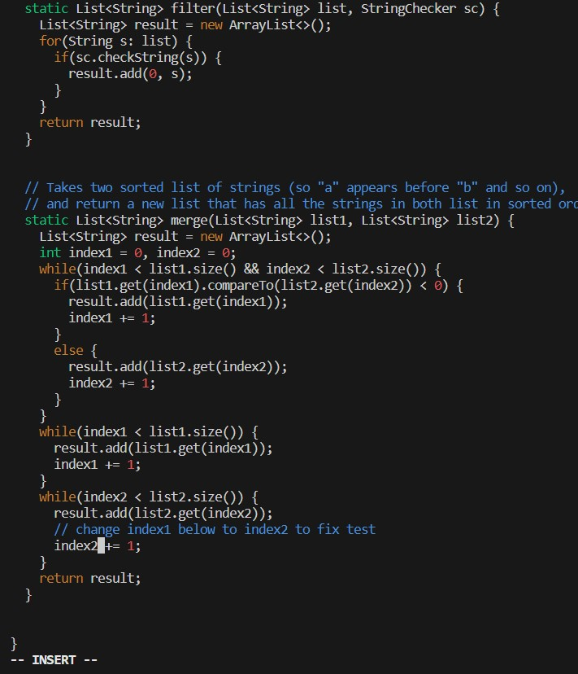
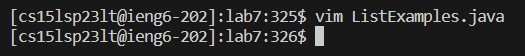
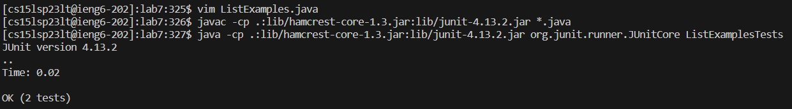
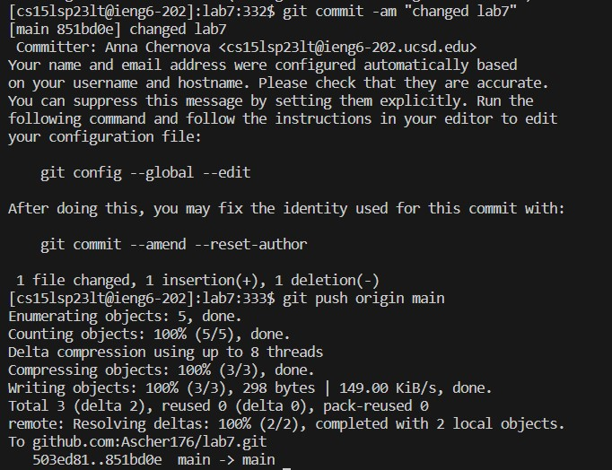

# Lab Report 4
4. Log into ieng6:  
    CTRL-R "ssh"<enter>  
      

5. Clone your fork of the repository from your Github account: 
    CTRL-R "git"<enter>     
        
  
6. Run the tests, demonstrating that they fail:
    cd lab7<enter>  
    <up><up><up><up><enter>  
    <up><up><up><up><enter>  
      
    
7. Edit the code file to fix the failing test:  
    vim Li<tab>.java<enter>  
    i<up><up><up><up><up><up><right>(12 times)<delete>2<esc>:wq   
       
        
    
8. Run the tests, demonstrating that they now succeed:  
    <up><up><up><enter>  
    <up><up><up><enter>  
      
      
9. Commit and push the resulting change to your Github account:  
    git commit -am "changed lab7"<enter>  
    git push origin main<enter>  
      
Thank you for reading!
