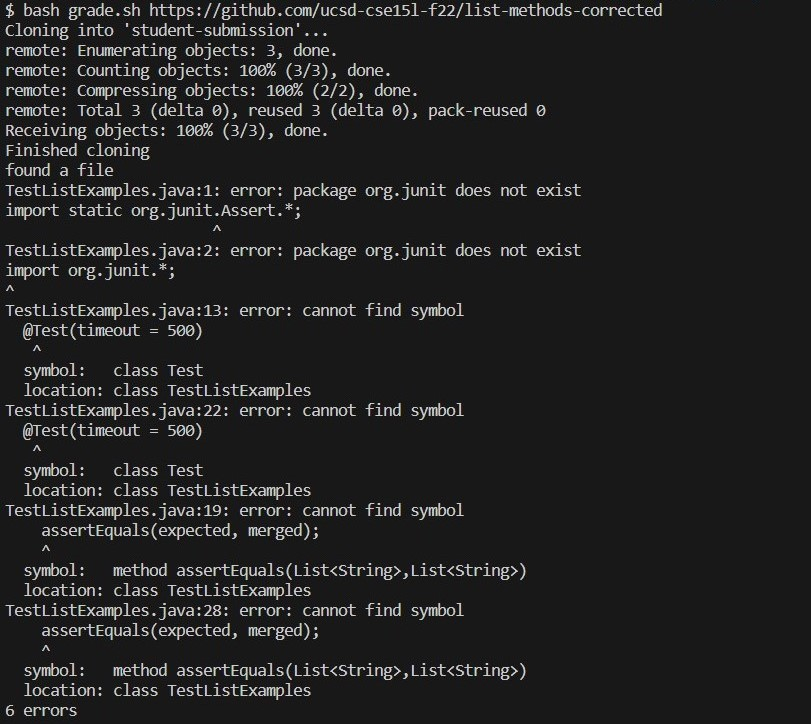

# Lab Report 5
## Part 1 – Debugging Scenario
### 1
EdStem quastion:  
What environment are you using (computer, operating system, web browser, terminal/editor, and so on)?  

Windows, VSCode  

Detail the symptom you're seeing. Be specific; include both what you're seeing and what you expected to see instead. Screenshots are great, copy-pasted terminal output is also great. Avoid saying “it doesn't work”.  

I am running a grade.sh bash script with a correct implementation of ListExamples class (from lab3), so I am expecting to see the message that the tests have passed. Instead of that I see error messages. My guess is that something is wrong with the library for testing or my code cannot access it for some reason. This is my bash script:
  

And these are the errors I get:  
  

Detail the failure-inducing input and context. That might mean any or all of the command you're running, a test case, command-line arguments, working directory, even the last few commands you ran. Do your best to provide as much context as you can.  
I am running the command $ bash grade.sh https://github.com/ucsd-cse15l-f22/list-methods-corrected.  

### 2
TA response: Since you are on Windows, be careful with what command you are using to run tests. Refer to lab3 to see a command for Windows.

### 3
Student response: I now noticed that the CPATH variable is not correct for Windows, so the problem was that my code couldn't see the test library because the path was not right. I got rid of it and copy-pasted the correct path from lab3 instead, and it works! Thank you for your help! The corrected version of the script and the expected output I now get:  
  
  

### 4
Setup:  
Initially, I took the repository from lab 6 [(https://github.com/ucsd-cse15l-s23/list-examples-grader)](https://github.com/ucsd-cse15l-s23/list-examples-grader) and wrote the grade.sh from the screenshot. This is the link to my uncorrected code: [https://github.com/Ascher176/list-examples-grader-lab-report.git](https://github.com/Ascher176/list-examples-grader-lab-report.git). To set it up I ran the following commands (cloned the repository and chnaged my current working directory to it):
```
$ git clone https://github.com/Ascher176/list-examples-grader-lab-report.git 
$ cd list-examples-grader-lab-report/
```
The error inducing command (running the bash script):  
$ bash grade.sh https://github.com/ucsd-cse15l-f22/list-methods-corrected  
To fix the bug in grade.sh I deleted the variable CPATH and pasted **".;lib/hamcrest-core-1.3.jar;lib/junit-4.13.2.jar"** on the line starting with javac, and **".;lib/junit-4.13.2.jar;lib/hamcrest-core-1.3.jar"** on the line starting with java.


